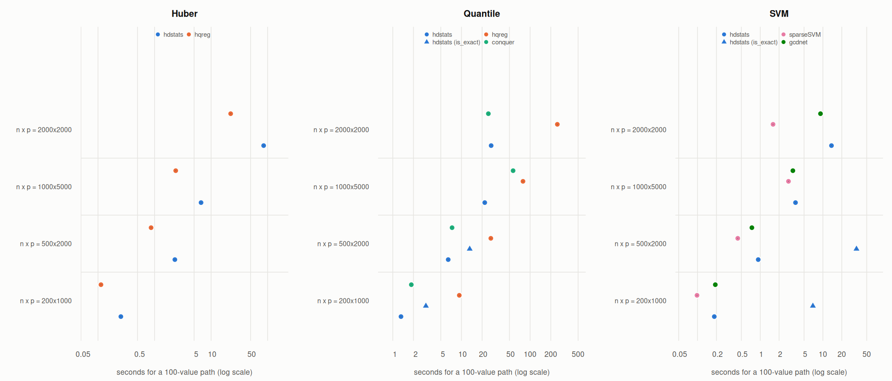

# Benchmarks: hdstats versus mainstream packages

Reproducible comparison of **hdstats** with the mainstream R packages that fit
the same or closely related models. All scripts run from the package root and
write their results to `results/` and figures to `figures/`:

| Script | What it measures |
|---|---|
| `01-speed.R` | Time to compute a 100-value solution path on identical data, single-threaded, median of 3 runs. |
| `02-quality.R` | Optimization accuracy: the value of the penalized objective reached by each solver at the same `lambda` values (no standardization), relative to the exact optimum. |
| `03-accuracy.R` | Statistical performance at the cross-validation-selected `lambda` of each package: estimation error, variable selection, test error, over replicated simulations. |
| `04-figures.R`, `05-tables.R` | Figures and markdown tables from the CSV results. |

Run with `HDSTATS_BENCH_QUICK=1` for a smoke test; `HDSTATS_BENCH_REPS` sets
the number of timing repetitions (speed) or simulation replications (accuracy).

## Competitors and how the problems were matched

| Model | hdstats | Competitors | Notes on matching |
|---|---|---|---|
| Huber regression | `hdhuber()` | **hqreg** (semismooth Newton coordinate descent) | hqreg's Huber loss is ours divided by `gamma`, so `lambda_hqreg = lambda / delta` reproduces the same problem. |
| Quantile regression | `hdqr()` | **hqreg** (`method = "quantile"`), **conquer** (convolution-smoothed QR, LAMM), **quantreg** (`rq(method = "lasso")`, interior-point LP) | Same check loss and `(1/n) sum + lambda * L1` scaling in hqreg and conquer. quantreg's lasso penalizes the summed loss with `lambda/2 * L1`, so `lambda_rq = 2 n lambda`. |
| Linear SVM | `hdsvm()` | **sparseSVM** (huberized hinge, semismooth Newton CD), **gcdnet** (`hhsvm`, Huberized *squared* hinge), **LiblineaR** (`type = 5`, L1-regularized *squared* hinge, one cost value), **quantreg** LP (hinge = check loss at `tau = 1`) | Only sparseSVM targets the same hinge-loss objective; gcdnet and LiblineaR fit different losses and are reported for speed only. sparseSVM codes the first level of `y` as +1, so its weights are sign-flipped before evaluating the objective. |
| Wilcoxon rank regression | `hdrr()` | **Rfit** (unpenalized), **quantreg** on all pairwise differences (unpenalized LP) | No mainstream package fits penalized rank regression; `hdrr()` computes a 100-value path while the competitors compute one unpenalized fit. |
| Least squares (reference) | | **glmnet** | Reference for the statistical comparison. |

`rqPen` was not included: its `alg = "huber"` is hqreg and its `alg = "br"` is
quantreg, both covered above.

## Results

### 1. Speed

Single-threaded elapsed time for a 100-value `lambda` path on the same
simulated data (sparse signal with 10 nonzero coefficients, AR(1) design,
t3 errors; for the SVM a linear signal with 10% label noise), median of 3
runs. `lambda.min / lambda.max` is 0.01 for p > n and 1e-4 for n >= p in all
packages that expose it. quantreg's linear-programming solver has no warm
starts and is run on 10 `lambda` values only, for the smallest size.

**Huber**: median elapsed seconds of 3 runs; the ratio is time / time of hdstats' default solver at that size.

| method (seconds; ratio to hdstats default) | 200 x 1000 | 500 x 2000 | 1000 x 5000 | 2000 x 2000 |
|---|---|---|---|---|
| hdhuber() | 0.25 s (1.0x) | 2.29 s (1.0x) | 6.64 s (1.0x) | 84.94 s (1.0x) |
| hqreg(method = 'huber') | 0.11 s (0.4x) | 0.87 s (0.4x) | 2.37 s (0.4x) | 22.18 s (0.3x) |

**Quantile**: median elapsed seconds of 3 runs; the ratio is time / time of hdstats' default solver at that size.

| method (seconds; ratio to hdstats default) | 200 x 1000 | 500 x 2000 | 1000 x 5000 | 2000 x 2000 |
|---|---|---|---|---|
| hdqr() | 1.32 s (1.0x) | 6.41 s (1.0x) | 21.84 s (1.0x) | 27.07 s (1.0x) |
| hdqr(is_exact = TRUE) | 3.03 s (2.3x) | 13.19 s (2.1x) |  |  |
| hqreg(method = 'quantile') | 9.30 s (7.1x) | 26.79 s (4.2x) | 78.69 s (3.6x) | 249.01 s (9.2x) |
| conquer.reg() on hdqr's lambda sequence | 1.86 s (1.4x) | 7.30 s (1.1x) | 56.50 s (2.6x) | 24.65 s (0.9x) |
| rq(method = 'lasso'), 10 lambda values | 37.95 s (28.8x) |  |  |  |

**SVM**: median elapsed seconds of 3 runs; the ratio is time / time of hdstats' default solver at that size.

| method (seconds; ratio to hdstats default) | 200 x 1000 | 500 x 2000 | 1000 x 5000 | 2000 x 2000 |
|---|---|---|---|---|
| hdsvm() | 0.18 s (1.0x) | 0.93 s (1.0x) | 3.65 s (1.0x) | 13.70 s (1.0x) |
| hdsvm(is_exact = TRUE) | 6.92 s (37.4x) | 34.30 s (36.9x) |  |  |
| sparseSVM() | 0.10 s (0.5x) | 0.44 s (0.5x) | 2.82 s (0.8x) | 1.60 s (0.1x) |
| gcdnet(method = 'hhsvm'), Huberized squared hinge | 0.19 s (1.0x) | 0.74 s (0.8x) | 3.32 s (0.9x) | 9.15 s (0.7x) |
| LiblineaR(type = 5), one cost value | 0.06 s (0.3x) | 0.21 s (0.2x) | 0.92 s (0.3x) | 1.10 s (0.1x) |

**Rank**: median elapsed seconds of 3 runs; the ratio is time / time of hdstats' default solver at that size.

| method (seconds; ratio to hdstats default) | 100 x 10 | 200 x 20 | 400 x 20 |
|---|---|---|---|
| hdrr(), 100-value path | 0.45 s (1.0x) | 2.04 s (1.0x) | 9.02 s (1.0x) |
| rfit(), one unpenalized fit | 0.02 s (0.0x) | 0.03 s (0.0x) | 0.03 s (0.0x) |
| rq() on all pairwise differences, one fit | 0.04 s (0.1x) | 0.60 s (0.3x) | 9.97 s (1.1x) |

What the timings show:

- **Huber regression.** hqreg's semismooth Newton coordinate descent is
  2.5 to 3.8 times faster than `hdhuber()` at every size.
- **Quantile regression.** `hdqr()` is 3.6 to 9.2 times faster than hqreg's
  quantile solver and comparable to conquer (0.9 to 2.6 times conquer's
  time), while reaching a better objective than either (next section).
  The exact LP solver in quantreg needs 38 s for 10 `lambda` values at the
  smallest size, against 1.3 s for the 100-value `hdqr()` path.
  `is_exact = TRUE` roughly doubles the run time.
- **SVM.** sparseSVM is 1.3 to 8.6 times faster than `hdsvm()` (its
  advantage grows with n), gcdnet's Huberized squared hinge is on par, and
  a single LiblineaR fit costs 10 to 30% of a whole `hdsvm()` path.
  `hdsvm(is_exact = TRUE)` is about 37 times slower than the default.
- **Rank regression.** No mainstream package fits penalized rank
  regression. A 100-value `hdrr()` path costs 0.5 to 9 s for n = 100 to
  400, against 0.02 to 0.03 s for one unpenalized `Rfit::rfit()` fit; the
  exact LP on all pairwise differences (quantreg) takes as long as the whole
  `hdrr()` path at n = 400.

### 2. Optimization quality

For the same `lambda` values (five positions along the 100-value path) and
with no standardization, each solver's objective value is compared with the
exact optimum: the Huber problem is smooth and all solvers converge to the
same value; the quantile and hinge problems are linear programs solved
exactly with `quantreg::rq(method = "lasso")`. The full per-`lambda` tables
(with the number of nonzero coefficients and the time for the five fits)
are in [`results/tables.md`](results/tables.md).

Maximum relative objective gap over the five lambda values, by solver (0 = the best solution found; the LP references are exact).

| model | solver | max gap, n = 200, p = 500 | max gap, n = 400, p = 200 |
|---|---|---|---|
| Huber | hdstats::hdhuber (eps = 1e-12) | 6.3e-13 |   0 |
| Huber | hqreg::hqreg_raw (eps = 1e-10) | 1.8e-06 | 3.6e-08 |
| Huber | hdstats::hdhuber (default) | 6.7e-05 | 2.1e-06 |
| Huber | hqreg::hqreg_raw (default) | 0.00066 | 3.1e-05 |
| QR tau = 0.3 | quantreg::rq lasso (LP, exact) |   0 |   0 |
| QR tau = 0.3 | hdstats::hdqr (is_exact = TRUE) | 0.0063 | 0.0053 |
| QR tau = 0.3 | hqreg::hqreg_raw (eps = 1e-10) | 0.032 | 0.016 |
| QR tau = 0.3 | hdstats::hdqr (default) | 0.048 | 0.019 |
| QR tau = 0.3 | hqreg::hqreg_raw (default) | 0.078 | 0.016 |
| QR tau = 0.3 | conquer::conquer.reg (uniform kernel, epsilon = 1e-6) | 0.26 | 0.026 |
| QR tau = 0.3 | conquer::conquer.reg (Gaussian kernel, default) | 0.39 | 0.062 |
| QR tau = 0.5 | quantreg::rq lasso (LP, exact) |   0 |   0 |
| QR tau = 0.5 | hdstats::hdqr (is_exact = TRUE) | 0.0064 | 0.0048 |
| QR tau = 0.5 | hqreg::hqreg_raw (eps = 1e-10) | 0.041 | 0.01 |
| QR tau = 0.5 | hdstats::hdqr (default) | 0.055 | 0.015 |
| QR tau = 0.5 | conquer::conquer.reg (uniform kernel, epsilon = 1e-6) | 0.09 | 0.021 |
| QR tau = 0.5 | hqreg::hqreg_raw (default) | 0.1 | 0.01 |
| QR tau = 0.5 | conquer::conquer.reg (Gaussian kernel, default) | 0.23 | 0.04 |
| SVM | quantreg::rq lasso (LP, exact) |   0 |   0 |
| SVM | hdstats::hdsvm (default, hval = 1) | 1.9 | 2.1 |
| SVM | hdstats::hdsvm (hval = 0.1) |  11 |  42 |
| SVM | hdstats::hdsvm (is_exact = TRUE) |  12 | 6.2 |
| SVM | sparseSVM::sparseSVM (gamma = 0.01, eps = 1e-8) |  98 | 1.1e+02 |
| SVM | sparseSVM::sparseSVM (gamma = 0.1, default) | 1e+02 | 1.1e+02 |

What the objective gaps show:

- **Huber.** `hdhuber()` and hqreg both reach the optimum; at default
  tolerances `hdhuber()` is within 7e-5 and hqreg within 7e-4, and both go
  to machine precision with tighter tolerances.
- **Quantile regression.** With default settings `hdqr()` is within 2%
  (n > p) and 5.5% (p > n) of the LP optimum, `is_exact = TRUE` within
  0.65%. hqreg's defaults are within 1.6% (n > p) and 10% (p > n), and
  conquer within 6% (n > p) and 39% (p > n). conquer targets the
  convolution-smoothed estimator with a statistically chosen bandwidth,
  so its gap to the non-smoothed optimum is by design; `hdqr()` and hqreg
  target the non-smoothed problem.
- **SVM.** No coordinate-descent solver comes close to the hinge-loss
  optimum on these problems. With the default bandwidth (`hval = 1`)
  `hdsvm()` is only solving the h = 1 smoothed problem, and its hinge
  objective is 1.1 to 3 times the optimum (gap 0.09 to 2.1). Decreasing the
  bandwidth (`hval = 0.1`) or using `is_exact = TRUE` makes the objective
  *worse* (gap up to 42), because coordinate descent on the smoothed hinge
  slows down as the bandwidth shrinks and stops far from the optimum even
  with 1e6 passes. sparseSVM (huberized hinge) is further away still
  (gap 0.4 to 110). With the ridge penalty alone (`lambda = 0`),
  `hdsvm(is_exact = TRUE)` does reproduce the SVM quadratic-program
  solution of e1071 (see `tests/testthat/test-hdsvm.R`). Cross-validated
  prediction accuracy is much less sensitive than the objective value
  (section 3), but the paper should not claim exact solutions of the
  L1-penalized SVM.

### 3. Statistical performance

ACCURACY_PLACEHOLDER
