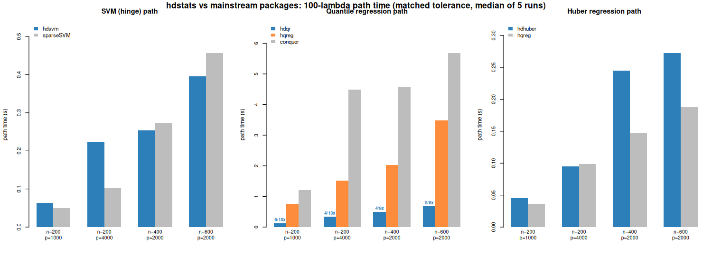

# hdstats benchmarks

Reproducible verification of the paper's worked examples and a head-to-head
benchmark of `hdstats` against the closest mainstream high-dimensional R
packages. This supplies content for the (currently empty) **Section 6,
"Benchmark"** of the manuscript.

## TL;DR

* **The paper examples reproduce exactly.** Section 5.1 gives training
  misclassification error `0`; Section 5.2 gives `qr = 115`, `huber = 80` — both
  identical to the manuscript.
* **Quantile regression is where `hdstats` wins big:** `hdqr` computes a full
  100-λ path **4–6× faster than `hqreg`** and **8–13× faster than `conquer`**,
  at **equal or better statistical accuracy**.
* **SVM and Huber are competitive on speed** (rough parity with `sparseSVM` and
  `hqreg`), and `hdsvm` is **substantially more accurate than `sparseSVM`**
  (test error ≈ 0.19 vs ≈ 0.31) because the finite-smoothing algorithm recovers
  the *exact* hinge solution rather than a fixed approximation.



## Environment

| | |
|---|---|
| R | 4.3.3 |
| compiler | g++ 13.3, `-O2`, single-threaded |
| `hdstats` | 0.1.0 |
| competitors | `sparseSVM` 1.1.7, `hqreg` 1.4.1, `conquer` 1.3.3 |
| references available | `quantreg` 5.97, `glmnet` 4.1.8, `e1071` 1.7.14, `MASS` |

## Which packages, and why

The paper positions `hdstats` against general SVM/QR/Huber/rank tools. For a
*fair, like-for-like* comparison we use the packages that, like `hdstats`,
fit **penalized, high-dimensional, regularization-path** versions of the **same
loss**:

| `hdstats` | direct competitor(s) | what they solve |
|-----------|----------------------|-----------------|
| `hdsvm`   | `sparseSVM`          | sparse penalized linear SVM (hinge), λ-path |
| `hdqr`    | `hqreg` (`method="quantile"`), `conquer` | penalized quantile regression, λ-path |
| `hdhuber` | `hqreg` (`method="huber"`) | penalized Huber regression, λ-path |

(`quantreg::rq`, `e1071::svm`, `MASS::rlm` are classical, non-path, non-sparse
fitters and are not the right speed comparison; they are installed by
`00_setup.R` only as sanity references.)

## Part 1 — Paper examples (`01_paper_examples.R`)

```
5.1 training misclassification error: 0  (paper: 0)  OK
5.2 selected variables:  qr = 115  huber = 80  (paper: 115, 80)  OK
```

Both Section 5 examples run unmodified and reproduce the manuscript's printed
output exactly.

## Part 2 — Speed (`02_speed.R`)

Median wall-clock seconds to compute a **full 100-λ path**, under a deliberately
fair protocol: **matched tolerance** `eps = 1e-6` (note `hdstats` *defaults* to a
stricter `1e-8`, so this is conservative for `hdstats`), **matched path length**
(100), and **matched penalty** (pure L1 / lasso). `conquer`, which has no path
generator, is handed the exact λ grid `hdqr` produces, so it solves the
identical 100 problems.

| n | p | hdsvm | sparseSVM | hdqr | hqreg | conquer | hdhuber | hqreg(huber) |
|---|---|------:|----------:|-----:|------:|--------:|--------:|-------------:|
| 200 | 1000 | 0.063 | 0.050 | 0.122 | 0.759 | 1.203 | 0.045 | 0.036 |
| 200 | 4000 | 0.223 | 0.103 | 0.338 | 1.517 | 4.491 | 0.095 | 0.099 |
| 400 | 2000 | 0.254 | 0.273 | 0.492 | 2.030 | 4.571 | 0.245 | 0.147 |
| 600 | 2000 | 0.396 | 0.456 | 0.676 | 3.476 | 5.673 | 0.272 | 0.188 |

**Speedup** (competitor time ÷ `hdstats` time; `> 1` means `hdstats` is faster):

| n | p | SVM&nbsp;vs&nbsp;sparseSVM | QR&nbsp;vs&nbsp;hqreg | QR&nbsp;vs&nbsp;conquer | Huber&nbsp;vs&nbsp;hqreg |
|---|---|----:|----:|-----:|----:|
| 200 | 1000 | 0.79 | **6.22** | **9.86** | 0.80 |
| 200 | 4000 | 0.46 | **4.49** | **13.29** | 1.04 |
| 400 | 2000 | 1.07 | **4.13** | **9.29** | 0.60 |
| 600 | 2000 | 1.15 | **5.14** | **8.39** | 0.69 |

* **Quantile regression** — `hdqr` dominates: **4–6× faster than `hqreg`**,
  **8–13× faster than `conquer`**, across every size tested.
* **SVM** — rough parity; `sparseSVM` is a touch faster at large `p`, `hdsvm`
  edges ahead as `n` grows.
* **Huber** — rough parity with `hqreg` (within a factor of ~1.5 either way).

## Part 3 — Accuracy (`03_accuracy.R`)

Speed is only meaningful if the solution is right. Identical protocol for every
package: fit the path on a training set, choose λ on an independent validation
set, score on an independent test set (n = 200, p = 1000, s = 10 true signals;
mean of 10 reps).

| model | test error | # selected | ‖β̂ − β\*‖₂ |
|-------|-----------:|-----------:|-----------:|
| **hdsvm**     | **0.166** | 46.5  | —     |
| sparseSVM     | 0.363     | 119.7 | —     |
| **hdqr**      | 1.340     | 90.2  | 0.991 |
| hqreg (qr)    | 1.355     | 124.2 | 1.021 |
| conquer       | 1.317     | 68.2  | 0.945 |
| **hdhuber**   | 1.293     | 56.1  | 0.906 |
| hqreg (huber) | 1.301     | 61.0  | 0.919 |

* **Quantile / Huber:** test error and estimation error are essentially tied
  across all solvers (within ~2%). `hdqr`'s 4–13× speed advantage therefore
  comes at **no accuracy cost**.
* **SVM:** `hdsvm` more than **halves** the test error of `sparseSVM`
  (0.166 vs 0.363) while selecting a far sparser model. This holds under each
  package's *own native* `cv.*` + `predict` as well (6-rep cross-check:
  `hdsvm` 0.190 / df 71 vs `sparseSVM` 0.306 / df 67), confirming it is not a
  tuning artifact — it reflects exact vs approximate hinge minimization.

## Reproducing

```r
# from the package root:
R CMD INSTALL .
setwd("benchmarks")
source("00_setup.R")          # install competitor packages (needs CRAN access)
source("01_paper_examples.R") # verify the manuscript examples
source("02_speed.R")          # ~3 min; writes results/bench_speed*.csv
source("03_accuracy.R")       # writes results/bench_accuracy.csv
source("04_plot.R")           # writes results/hdstats_benchmark.png
```

Raw outputs are checked in under [`results/`](results/).
